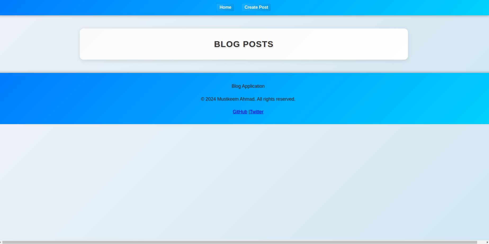
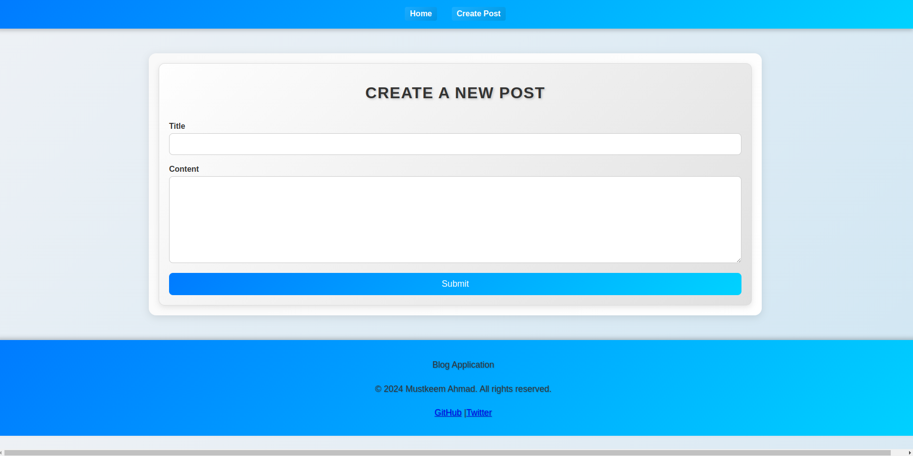

# Blog Application

A simple and responsive blog application built with React. This application allows users to view a list of posts, view details of individual posts, and create new posts. It also includes basic error handling, private routes, and SEO improvements.

## DEMO 




## Features

- **Post List**: View a list of all blog posts.
- **Post Detail**: View detailed information about a specific post.
- **Create Post**: Add new posts to the blog.
- **404 Page**: Displays a custom 404 error page for non-existent routes.
- **Private Routes**: Protect certain routes to ensure only authenticated users can access them.
- **SEO Optimization**: Includes meta tags for better search engine visibility.

## Technologies Used

- **React**: JavaScript library for building user interfaces.
- **React Router**: For routing and navigation.
- **React Helmet** or **React Helmet Async**: For managing document head (meta tags).
- **CSS**: For styling the application.

## Installation

1. Clone the repository:

   ```bash
   git clone https://github.com/your-username/blog-app.git
   cd blog-app
   ```

2. Install dependencies:

   ```bash
   npm install
   ```

   Or, if you are using Yarn:

   ```bash
   yarn install
   ```

3. Run the application:

   ```bash
   npm start
   ```

   Or:

   ```bash
   yarn start
   ```

   The application will be available at `http://localhost:3000`.

## Components

- **`App.js`**: The main component that sets up the router and routes.
- **`PostList.js`**: Displays the list of posts.
- **`PostDetail.js`**: Shows details for a specific post.
- **`PostForm.js`**: Form for creating new posts.
- **`NotFound.js`**: Displays a 404 error page.
- **`PrivateRoute.js`**: Handles private routing logic.

## Adding New Features

1. **Create a New Component**: Add a new file in the `src/components` directory.
2. **Update Routing**: Modify `App.js` to include new routes.
3. **Add Styles**: Create or update CSS files in the `src/styles` directory.

## Contributing

Feel free to fork the repository and submit pull requests. For significant changes, please open an issue to discuss what you would like to change.

## License

This project is licensed under the MIT License - see the [LICENSE](LICENSE) file for details.

## Contact

For any questions or feedback, please contact me at [kevin.montenegro0@yahoo.com](mailto:kevin.montenegro0@yahoo.com).

---

Happy coding!
```
